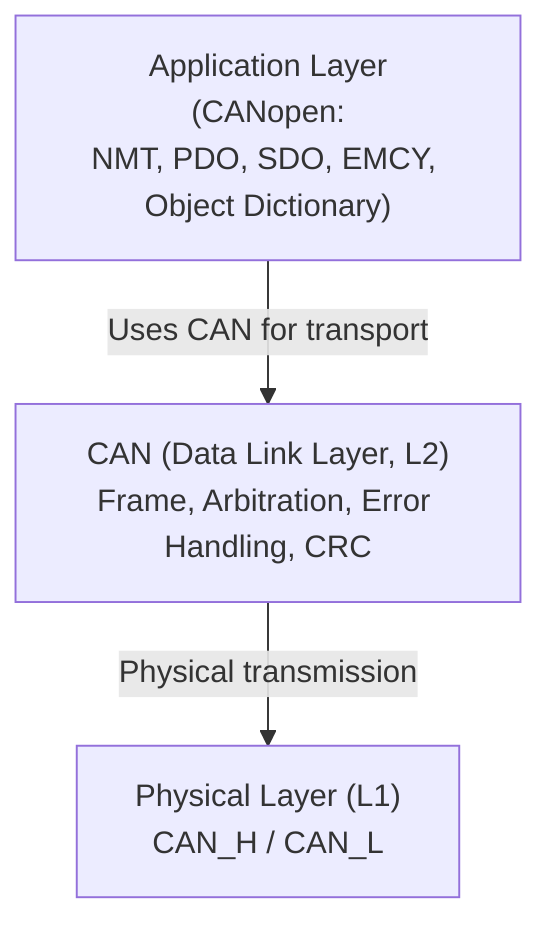

# Протокол CAN 
## Назначение и область применения

CAN-шина или **CAN (Controller Area Network)** -- это промышленный стандарт последовательной сети, предназначенный для обмена данными между микроконтроллерами и устройствами без использования центрального компьютера (multi-master). Стандарт определен ISO (ISO 11898).

**Ключевая идея** -- несколько устройств делят одну дифференциальную линию и сами договариваются, кто передает первым. При этом:
- нет коллизий с потерей кадра;
- приоритет сообщения определяется его идентификатором;
- ошибки детектируются аппаратно;
- неисправный узел автоматически изолируется.

**Область применения** -- автомобилестроение (ABS, двигатель), авиация, спутниковые системы (CubeSat, LEO-группировки), промышленная автоматизация, лифтовое оборудование.

## Используемые уровни OSI

Протокол CAN в классическом виде описывает только два нижних уровня модели OSI:
- **Physical Layer (физический уровень)** -- определяет электрические параметры передачи, уровни сигналов (CAN_H и CAN_L) и требования к физической среде.
- **Data Link Layer (канальный уровень)** -- определяет формат кадра, механизм арбитража, обнаружение и обработку ошибок, а также управление доступом к общей шине.

## Описание структуры фрейма (Standard CAN 2.0A)

Упрощенная структура стандартного кадра представлена на диаграмме. Каждое поле -- это отдельный этап жизни одного сообщения на CAN-шине.

<svg width="900" height="80" viewBox="0 0 900 80" xmlns="http://www.w3.org">
  <!-- Определяем стрелку (маркер) -->
  <defs>
    <marker id="arrowhead" markerWidth="10" markerHeight="7" refX="0" refY="3.5" orient="auto">
      <polygon points="0 0, 10 3.5, 0 7" fill="#666" />
    </marker>
  </defs>

  <!-- Стили для текста и блоков -->
  

  <!-- Блоки -->
  <g transform="translate(10, 20)">
    <rect width="50" height="40" rx="5" /> <text x="25" y="20">SOF</text>
    <line x1="50" y1="20" x2="65" y2="20" stroke="#666" marker-end="url(#arrowhead)" />
    <g transform="translate(75, 0)">
      <rect width="80" height="40" rx="5" /> <text x="40" y="20">Arbitration</text>
      <line x1="80" y1="20" x2="95" y2="20" stroke="#666" marker-end="url(#arrowhead)" />
    </g>
    <g transform="translate(180, 0)">
      <rect width="70" height="40" rx="5" /> <text x="35" y="20">Control</text>
      <line x1="70" y1="20" x2="85" y2="20" stroke="#666" marker-end="url(#arrowhead)" />
    </g>
    <g transform="translate(275, 0)">
      <rect width="60" height="40" rx="5" /> <text x="30" y="20">Data</text>
      <line x1="60" y1="20" x2="75" y2="20" stroke="#666" marker-end="url(#arrowhead)" />
    </g>
    <g transform="translate(360, 0)">
      <rect width="50" height="40" rx="5" /> <text x="25" y="20">CRC</text>
      <line x1="50" y1="20" x2="65" y2="20" stroke="#666" marker-end="url(#arrowhead)" />
    </g>
    <g transform="translate(435, 0)">
      <rect width="50" height="40" rx="5" /> <text x="25" y="20">ACK</text>
      <line x1="50" y1="20" x2="65" y2="20" stroke="#666" marker-end="url(#arrowhead)" />
    </g>
    <g transform="translate(510, 0)">
      <rect width="50" height="40" rx="5" /> <text x="25" y="20">EOF</text>
      <line x1="50" y1="20" x2="65" y2="20" stroke="#666" marker-end="url(#arrowhead)" />
    </g>
    <g transform="translate(585, 0)">
      <rect width="90" height="40" rx="5" /> <text x="45" y="20">Intermission</text>
    </g>
  </g>
</svg>

Таблица 1 -- Детализация полей стандартного кадра

<table class="custom-table">
    <tr>
        <th style="text-align: center; vertical-align: center;">Поле</th>
        <th style="text-align: center; vertical-align: center;">Размер (бит)</th>
        <th style="text-align: center; vertical-align: center;">Описание</th>
    </tr>
    <tr>
        <td>SOF (Start of Frame)</td>
        <td>1</td>
        <td><strong>Начало кадра</strong>. Доминантный бит («0»), обеспечивающий жесткую синхронизацию генераторов всех узлов сети</td>
    </tr>
    <tr>
        <td>Arbitration Field</td>
        <td>12</td>
        <td><strong>Поле арбитража</strong>. Включает 11-битный идентификатор (ID) и бит RTR. Определяет приоритет сообщения при одновременном доступе к шине. <i>Бит RTR используется для запроса данных от другого узла. В обычных данных он доминантный («0»)</td>
    </tr>
    <tr>
        <td>Control Field</td>
        <td>6</td>
        <td><strong>Поле управления</strong>. Содержит бит IDE (0 для Standard), резервный бит r0 и 4-битный код DLC (Data Length Code), указывающий количество байт данных</td>
    </tr>
    <tr>
        <td>Data Field</td>
        <td>0–64</td>
        <td><strong>Поле данных</strong>. Полезная нагрузка сообщения (от 0 до 8 байт)</td>
    </tr>
    <tr>
        <td>CRC Field</td>
        <td>16</td>
        <td><strong>Контрольная сумма</strong>. 15-битная последовательность для проверки целостности кадра и 1-битный рецессивный разделитель (CRC Delimiter)</td>
    </tr>
    <tr>
        <td>ACK Field</td>
        <td>2</td>
        <td><strong>Поле подтверждения</strong>. Состоит из ACK Slot (приемники инвертируют в «0» при валидном CRC) и рецессивного разделителя (ACK Delimiter)</td>
    </tr>
    <tr>
        <td>EOF (End of Frame)</td>
        <td>7</td>
        <td><strong>Конец кадра</strong>. Фиксированная последовательность из 7 рецессивных бит («1»), сигнализирующая о завершении транзакции</td>
    </tr>
    <tr>
        <td>Intermission</td>
        <td>3</td>
        <td><strong>Межкадровый интервал</strong>. Минимальное время ожидания перед началом следующего цикла арбитража</td>
    </tr>
 </table>

{}
Обратите внимание, что физически в шине бит может быть чуть больше, так как контроллер вставляет [«стаффинговые»](#механизм-обнаружения-и-обработки-ошибок) биты для синхронизации (после каждых 5 одинаковых бит), но они удаляются приемником и не считаются частью логической структуры.
{}

## Описание механизма арбитрации

В основе механизма доступа к шине CAN лежит алгоритм **CSMA/CR** (Carrier Sense Multiple Access with Collision Resolution) -- множественный доступ с прослушиванием несущей и разрешением коллизий:

- Шина имеет два состояния: **Доминантное (0)** и **Рецессивное (1)**. Ноль всегда «побеждает» единицу.
- Если два узла начинают передачу одновременно, они сравнивают свои ID побитно.
- Как только один узел передает «1», а видит на шине «0» (от другого узла), он понимает, что его приоритет ниже, и мгновенно переходит в режим приема.
- **Итог**: узел с самым низким числовым значением ID имеет наивысший приоритет и передает данные без задержек.

**Следствие для проектирования**: схема идентификаторов должна разрабатываться на этапе архитектуры системы, поскольку она определяет приоритеты сообщений.

## Механизм обнаружения и обработки ошибок

CAN считается одной из самых надежных шин благодаря 5 методам контроля:
- **Bit Monitoring** -- узел читает то, что сам выдает в шину. Если уровни не совпадают -- ошибка.
- **Bit Stuffing** -- после 5 одинаковых бит вставляется инверсный бит для синхронизации.
- **CRC Check** -- проверка контрольной суммы.
- **Form Error** -- проверка структуры (стоп-биты и т.д.).
- **ACK Check** -- если никто не подтвердил прием, передатчик фиксирует ошибку.

Состояния узла CAN:
- **Error Active** -- нормальный режим работы;
- **Error Passive** -- повышенный уровень ошибок;
- **Bus Off** -- отключен от шины.

Узлы имеют счетчики ошибок, которые отслеживают различные типы ошибок (например, битовые ошибки, ошибки CRC и др.).\
Если количество ошибок превышает критический порог, узел переходит в состояние Bus Off, автоматически отключаясь от шины, чтобы не нарушать работу остальных устройств сети. В этом состоянии узел прекращает передачу данных и не может участвовать в арбитраже, пока не выполнит процедуру восстановления.

# Стек CANopen

## Назначение стека CANopen

Если CAN -- это «провода и способ кричать», то **CANopen** -- это «язык общения и правила вежливости». Это протокол прикладного уровня, который стандартизует, как именно данные (температура, скорость, команды) распределяются внутри сети.

## Используемые уровни OSI

CANopen реализует прикладной уровень модели OSI.

**Application Layer (прикладной уровень)** -- определяет структуру данных, модель взаимодействия устройств, типы сервисов (PDO, SDO, NMT, EMCY), а также правила адресации узлов и структуру словаря объектов.

CANopen не заменяет канальный уровень, а использует CAN как транспорт. Он стандартизует прикладную модель взаимодействия устройств **поверх** механизма передачи кадров CAN. Ниже представлена структурная схема уровней взаимодействия.

## Словарь объектов

Словарь объектов (Object Dictionary, OD) -- это таблица (база данных), где каждой настройке или переменной присвоен индекс:
- **Index (16 бит)** -- адрес ячейки (например, 0x1000 -- тип устройства);
- **Subindex (8 бит)** -- дополнительное деление для массивов или структур.\
Любое общение в сети сводится к чтению или записи в эти ячейки.

Таблица 2 -- Типовые диапазоны индексов

<table class="simple-table">
    <tr>
        <th style="text-align: center; vertical-align: center;">Диапазон</th>
        <th style="text-align: center; vertical-align: center;">Назначение</th>
    </tr>
    <tr>
        <td>0x0000–0x0FFF</td>
        <td>Зарезервировано</td>
    </tr>
    <tr>
        <td>0x1000–0x1FFF</td>
        <td>Communication Profile Area</td>
    </tr>
    <tr>
        <td>0x2000–0x5FFF</td>
        <td>Manufacturer Specific</td>
    </tr>
    <tr>
        <td>0x6000–0x9FFF</td>
        <td>Standardized Device Profile Area</td>
    </tr>
    <tr>
        <td>0xA000–0xFFFF</td>
        <td>Reserved</td>
    </tr>
 </table>

## Типы объектов коммуникации

Для передачи данных используются четыре основных механизма:
- **SDO (Service Data Object)** -- прямой доступ к словарю объектов.\
Надежный (с подтверждением), но медленный. Используется для настройки.
- **PDO (Process Data Object)** -- быстрая передача данных без квитирования.\
Привязывается к событиям (таймер, изменение данных). Бывает TPDO (передача) и RPDO (прием).
- **NMT (Network Management)** -- команды управления состоянием узлов (Start, Stop, Pre-operational).
- **Special Function Objects** -- синхронизация (SYNC), сообщения об ошибках (EMCY), временные метки (TIME).

## Адресация узлов (Node-ID)

Каждое устройство в сети получает уникальный идентификатор **Node-ID** (от 1 до 127). Значение 0 используется для широковещательных сообщений управления.

Адресация узлов позволяет избежать конфликтов идентификаторов в сети. Основные принципы адресации узлов:
- Адресация в CANopen строится на комбинации типа сообщения (Function Code) и Node-ID.
- Идентификатор кадра (CAN ID) для SDO-запроса вычисляется по принципу: *COB-ID = Function Code + Node-ID*.

# Глоссарий
## Протокол CAN (Нижний уровень)

**CAN (Controller Area Network)** -- последовательная промышленная шина, стандартизованная ISO 11898, реализующая физический и канальный уровни модели OSI для обмена сообщениями между узлами без центрального контроллера.\
**Physical Layer (Физический уровень)** -- первый уровень модели OSI. Определяет электрические параметры передачи, уровни сигналов CAN_H и CAN_L, синхронизацию и требования к среде передачи.\
**Data Link Layer (Канальный уровень)** -- второй уровень модели OSI. Определяет формат кадра CAN, механизм арбитража, обнаружение ошибок и управление доступом к шине.\
**Identifier (ID)** -- 11-битное (Standard) или 29-битное (Extended) значение, определяющее приоритет сообщения на шине CAN.\
**Arbitration (Арбитраж)** -- механизм разрешения одновременной передачи нескольких узлов. Побеждает сообщение с наименьшим числовым значением идентификатора.\
**CSMA/CR (Carrier Sense Multiple Access with Collision Resolution)** -- алгоритм множественного доступа с прослушиванием несущей и разрешением коллизий, используемый в CAN.\
**Dominant Bit (Доминантный бит)** -- логический «0». На физическом уровне он «сильнее» и всегда подавляет рецессивный бит.\
**Recessive Bit (Рецессивный бит)** -- логическая «1». Присутствует на шине только при отсутствии доминантного бита.\
**Bit Stuffing** -- метод синхронизации: после 5 одинаковых бит подряд контроллер автоматически вставляет один противоположный бит.\
**CRC (Cyclic Redundancy Check)** -- метод проверки целостности кадра на основе 15-битной контрольной суммы.\
**Error Active** -- состояние узла CAN при нормальном уровне ошибок. Узел участвует в передаче и может формировать активные error-фреймы.\
**Error Passive** -- состояние узла при повышенном уровне ошибок. Узел ограничен в генерации активных ошибок.\
**Bus Off** -- состояние узла, при котором он отключается от шины из-за критического количества ошибок, чтобы не мешать остальным.\
**RTR (Remote Transmission Request)** -- бит запроса данных. Позволяет одному узлу попросить другой прислать конкретное сообщение.

## Стек CANopen (Верхний уровень)

**CANopen** -- протокол прикладного уровня поверх CAN, стандартизующий модель данных, типы сервисов и правила взаимодействия устройств.\
**Application Layer (Прикладной уровень)** -- седьмой уровень модели OSI. В CANopen определяет структуру данных, словарь объектов и правила обмена сообщениями.\
**Object Dictionary (OD)** -- структурированная таблица параметров CANopen-устройства, организованная по 16-битным индексам и 8-битным субиндексам.\
**Index** -- 16-битный адрес записи в словаре объектов CANopen.\
**Subindex** -- 8-битное расширение индекса, используемое для обращения к элементам массива или структуры.\
**SDO (Service Data Object)** -- механизм надежного доступа к словарю объектов с подтверждением передачи.\
**PDO (Process Data Object)** -- механизм быстрой передачи данных без подтверждения, предназначенный для обмена процессными переменными.\
**NMT (Network Management)** -- механизм управления состояниями узлов CANopen (Start, Stop, Pre-operational).\
**SYNC** -- сообщение синхронизации в CANopen, обеспечивающее одновременное обновление данных.\
**EMCY (Emergency Message)** -- сообщение экстренного уведомления об ошибке устройства в CANopen.\
**Node-ID** -- уникальный идентификатор устройства CANopen в диапазоне 1–127.

---
